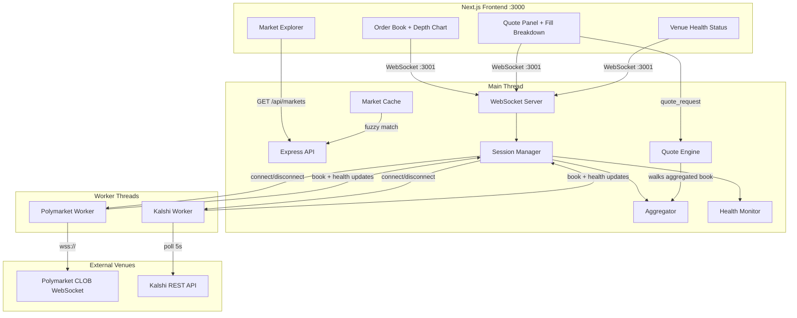
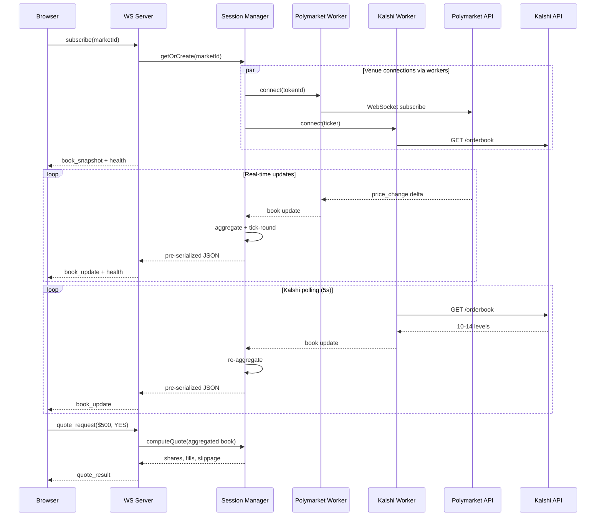
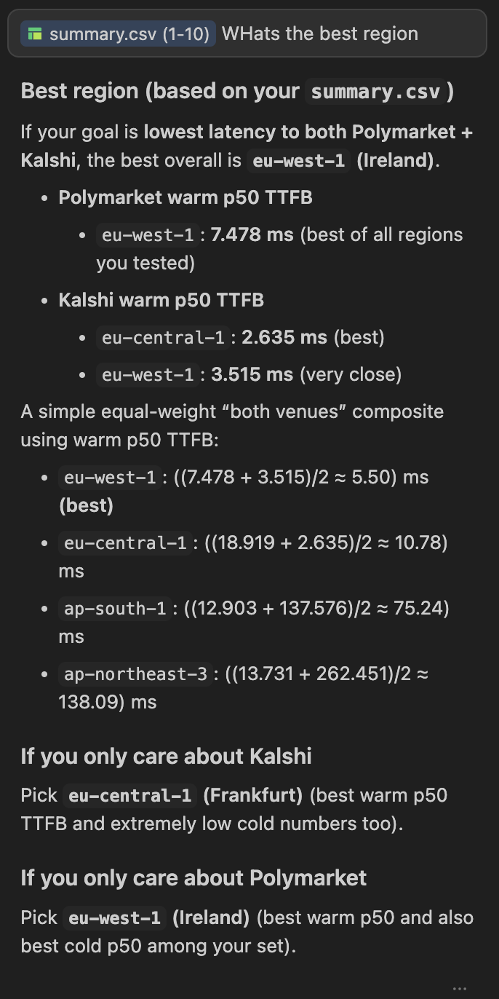

# Prediction Market Aggregator

Real-time order book aggregation and cross-venue quoting for prediction markets, combining liquidity from Polymarket and Kalshi into a single unified view.


https://github.com/user-attachments/assets/cedd20f0-492e-4430-be4c-661918f526bc


*Live order book aggregation across Polymarket and Kalshi — combined/per-venue toggle, depth chart, quote panel with cross-venue fill breakdown.*

## Quick Start

**Prerequisites:** Node.js >= 18, pnpm >= 9

```bash
# Install dependencies
pnpm install

# Start both server and frontend in dev mode
pnpm dev
```

- **Frontend:** http://localhost:3000
- **Server:** http://localhost:3001

> **Cold start:** On first launch the server fetches all active markets from Polymarket (~7k) and Kalshi (~6k) in parallel. This takes **~5-10 seconds** — the frontend shows skeleton loaders until the cache is ready. Kalshi's cursor-paginated API is typically the bottleneck.

All data is live — no mock mode, no API keys needed. Polymarket streams real-time order book depth via public WebSocket. Kalshi provides real orderbook depth (10-14 levels) via public REST polling — no authentication required.

## Architecture

```
apps/
  server/                Express + WebSocket server
    src/
      aggregator/        Order book merge + tick rounding utilities
      markets/           Polymarket/Kalshi fetchers, market cache, fuzzy matcher
      venues/            Base venue class
        live/            Polymarket live WS (polymarket-live.ts), Kalshi REST poller (kalshi-polling.ts)
      workers/           Worker thread handles and per-venue worker entry points
      quote/             Quote computation engine
      ws/                WebSocket server, client manager, session manager, protocol
      health/            Per-venue connection health monitor
  web/                   Next.js 15 frontend
    components/
      layout/            Header
      market/            MarketHeader, PriceChart, VenueStatus
      order-book/        OrderBook, OrderBookRow, DepthChart
      quote/             QuotePanel, FillBreakdown
    hooks/               useWebSocket, useOrderBook, useQuote
packages/
  shared-types/          TypeScript types (order book, quote, market, WS protocol)
```

### System Overview



### Data Flow



### Data Flow Summary

1. **Market discovery** — Server fetches listings from Polymarket (Gamma API, ~7000+ markets) and Kalshi (Elections API, ~6000+ markets), refreshes every 5 minutes
2. **Fuzzy matching** — Markets that exist on both venues are merged into single entries using Jaccard similarity with numeric guards (~74 matched pairs)
3. **Lazy sessions** — When a client subscribes to a market, venue connections are started via worker threads and an aggregator is created on the main thread. Sessions are destroyed 60s after the last subscriber leaves
4. **Order book aggregation** — Venue books are tick-rounded to 1¢, merged with per-venue attribution, and throttled at 100ms before broadcast
5. **Quote engine** — Walks the aggregated book to fill a dollar amount, splitting fills proportionally across venues at each price level
6. **Pre-serialized broadcast** — Book updates are JSON.stringified once per tick and sent as raw strings to all subscribers

## Key Design Decisions

### Worker threads for venue I/O
Each venue (Polymarket, Kalshi) runs in a dedicated worker thread, isolating WebSocket/HTTP I/O from the main thread. Aggregation (`aggregateBooks`) and quoting (`computeQuote`) remain on the main thread since they're lightweight arithmetic — microseconds per call — and need synchronous access to the combined book state.

### Server-side aggregation
The server merges venue books and computes quotes rather than sending raw venue data to the client. This keeps the WebSocket protocol simple (one aggregated book update per tick), avoids duplicating aggregation logic across clients, and reduces bandwidth.

### Fuzzy market matching via Jaccard similarity
Markets on Polymarket and Kalshi use different titles, slugs, and IDs. The matcher tokenizes titles, computes Jaccard similarity, and applies numeric guards (dates, thresholds) to avoid false positives like "Bitcoin above $90k" matching "Bitcoin above $100k". This merges ~74 markets into combined entries with unified volume and liquidity.

### Tick-rounding to 1¢ buckets
Polymarket uses continuous pricing while Kalshi uses cent-based. Rounding both to 0.01 tick size before merging ensures clean aggregation without floating-point dust.

### Lazy sessions with 60s TTL
Venue connections and aggregators are created only when a client subscribes and destroyed 60s after the last subscriber leaves. With 8000+ available markets, eagerly connecting to all would be infeasible.

### Pre-serialized broadcasts
Each session serializes the book update once via `JSON.stringify` and broadcasts the raw string to all subscribers — avoiding redundant serialization per client.

### Deployment region: eu-west-1

To minimize latency to both venue APIs, we spun up EC2 instances in 4 AWS regions and ran a custom latency probe (`infra/latency-test/02-probe.py`) measuring DNS, TCP, TLS, and TTFB (cold + warm) against both Polymarket and Kalshi endpoints.

| Region | Polymarket TTFB (warm p50) | Kalshi TTFB (warm p50) |
|---|---|---|
| eu-west-1 | **7.5 ms** | **3.5 ms** |
| eu-central-1 | 18.9 ms | 2.6 ms |
| ap-south-1 | 12.9 ms | 137.6 ms |
| ap-northeast-3 | 13.7 ms | 262.5 ms |

**eu-west-1 (Ireland)** wins — best Polymarket latency (7.5ms) with near-best Kalshi latency (3.5ms). Both Kalshi and Polymarket backends appear to be hosted in EU/US-East, making Ireland the optimal midpoint.



*Latency comparison across regions — eu-west-1 has the best combined TTFB for both venues.*

https://github.com/user-attachments/assets/4f150f3a-9390-410d-a508-d4df9f189d64


*Spinning up EC2 instances across 4 AWS regions to run latency probes.*


https://github.com/user-attachments/assets/e1689ae8-4df8-45ef-8b8e-571b774078e8


*Live latency probes running against Polymarket and Kalshi endpoints from each region.*

Full probe results with per-region JSON breakdowns are in [`infra/latency-test/results/`](infra/latency-test/results/).

## Assignment Requirements

| Requirement | Status | Implementation |
|---|---|---|
| **Market view** | Done | Order book with combined/per-venue toggle, depth chart with area fills, venue attribution bars |
| **Live aggregation** | Done | Polymarket live WS + Kalshi REST polling (both with real orderbook depth), venue health indicators, graceful degradation if one venue drops |
| **Quote experience** | Done | Dollar amount + side input → shares, avg price, slippage, potential return, price impact, per-venue fill breakdown |
| **Long-running behavior** | Done | Exponential backoff with jitter (1s–30s) on both server-side (Polymarket WS) and client-side (app WS), ping/pong keepalive, 100ms throttling, lazy session lifecycle |

### Additional features beyond requirements:
- **Market matching** — Fuzzy Jaccard similarity merges markets across venues into single entries
- **Price history** — Client-side accumulation of YES/NO mid prices, rendered as a dual-line chart
- **Skeleton loaders** — Shimmer loading states for market cards, order book, and quote panel
- **Health monitoring** — Per-venue connection state, stale data detection (5s timeout), latency tracking
- **Responsive UI** — Next.js 15 + Tailwind v4, grayscale theme with green/red/purple/amber accents

## Assumptions & Tradeoffs

- **Kalshi: real orderbook depth via public API.** The public `/orderbook` endpoint returns 10-14 price levels with dollar-denominated sizes (`orderbook_fp.yes_dollars`/`no_dollars`). Polled every 5s. When full depth is unavailable, the server falls back to synthetic 8-level depth generated from top-of-book data with exponential decay.

- **Polymarket: full depth, no auth needed.** The CLOB WebSocket (`wss://ws-subscriptions-clob.polymarket.com`) is publicly accessible. The server connects directly using the market's YES/NO token IDs for real-time level-2 data.

- **No real orders placed.** The quote panel is a pricing exercise — it calculates fills across the aggregated book but does not submit orders to either venue.

- **100ms throttle is a fixed tradeoff.** Updates are batched at 100ms to avoid flooding clients. The UI is at most 100ms behind the latest venue tick — acceptable for a quoting tool, not for HFT.

- **In-memory state only.** Market cache, sessions, and venue connections live in process memory. A server restart clears everything. Acceptable for a demo; production would add Redis or similar.

## What I'd Improve With More Time

- **Kalshi WebSocket feed** — Replace 5s REST polling (`kalshi-polling.ts`) with Kalshi's WebSocket orderbook stream to cut update latency from ~2.5s average to <100ms, matching Polymarket's real-time path
- **Delta encoding on the wire** — Session manager currently `JSON.stringify`s the full aggregated book every 100ms tick; switch to sending only changed price levels with a generation counter for ~70-90% payload reduction
- **Precomputed cumulative depth curves** — Cache running `{cumSize, cumCost}` per price level in the aggregator so `computeQuote()` can binary-search for fill boundaries in O(log n) instead of the current linear walk
- **SharedArrayBuffer for worker communication** — Replace `postMessage` structured clones in `VenueWorkerHandle` with shared typed arrays (`Float64Array`) for price/size data, eliminating 2-5ms copy overhead per book update
- **Row-level memoization** — Currently all 30 `OrderBookRow` components re-render on any price change; wrap with `React.memo` and a per-level comparator so only rows with actual changes re-render
- **Tests** — Unit tests for `aggregateBooks()`, `computeQuote()`; integration tests for the WS subscribe/quote flow; E2E with Playwright
